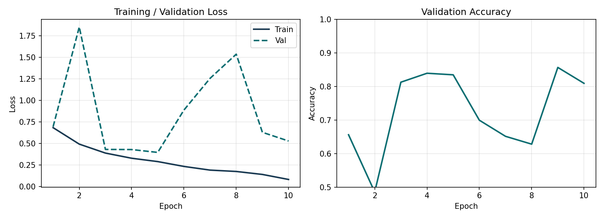
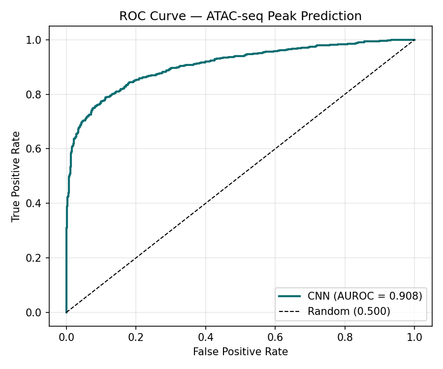
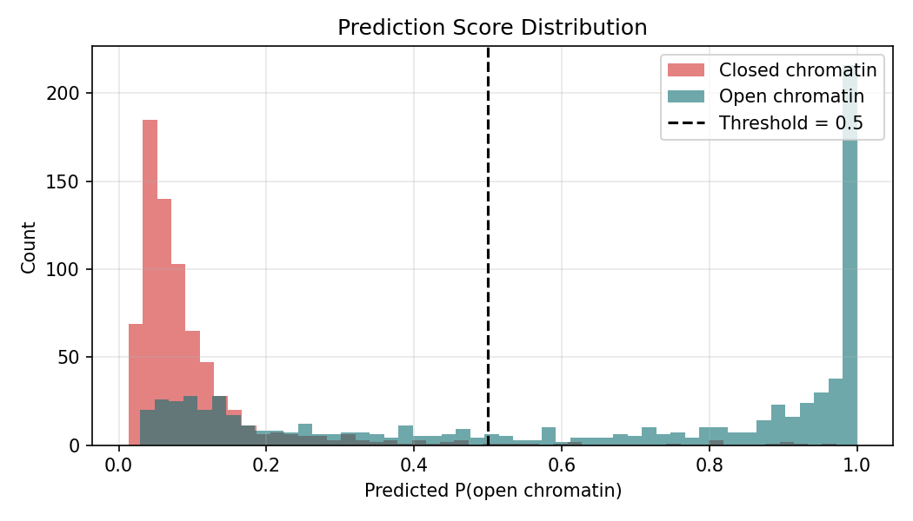
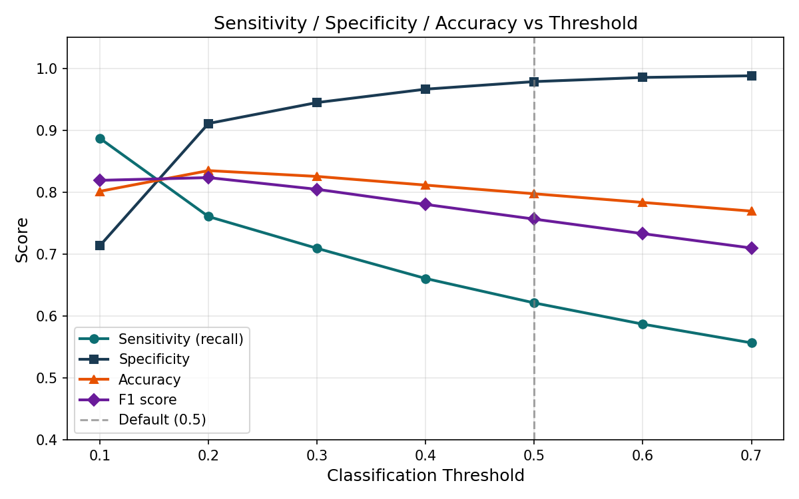

# ATAC-Seq Peak Prediction with Convolutional Neural Networks

**Author:** Nikhila T. Suresh, PhD
**Project type:** Computational biology / deep learning portfolio project
**Framework:** PyTorch
**Inspiration:** [scBasset (Yuan & Kelley, *Nature Methods* 2022)](https://www.nature.com/articles/s41592-022-01562-8)

---

## Project Overview

This project implements a convolutional neural network (CNN) that predicts chromatin
accessibility (ATAC-seq peaks) directly from DNA sequence. Given a 500 bp DNA window,
the model outputs the probability that the region is in open chromatin — accessible
to transcription factors and gene regulatory machinery.

The model is trained on synthetic sequences with embedded transcription factor binding
motifs from five families (AP-1, ETS, CTCF, GATA, SP1), learning to detect these
regulatory sequence patterns as convolutional filters. This is the same prediction task
underlying sequence-to-function models such as
[Enformer](https://www.nature.com/articles/s41592-021-01252-x) and
[Linder et al. 2025](https://www.nature.com/articles/s41588-024-02053-6).

---

## Main Biological Question

Can a convolutional neural network learn transcription factor binding motifs from raw
DNA sequence and use them to predict chromatin accessibility — without any pre-computed
features or prior biological knowledge beyond the sequence itself?

---

## Repository Structure

```
ATAC-Seq-Peak-CNN/
├── data/
│   └── generate_synthetic.py   # Generates training data with real TF motifs
├── src/
│   ├── model.py                 # CNN architecture
│   ├── dataset.py               # PyTorch Dataset and DataLoader
│   ├── train.py                 # Training loop with early stopping
│   ├── evaluate.py              # Metrics, ROC curves, visualizations
│   └── utils.py                 # One-hot encoding and DNA utilities
├── results/                     # Model checkpoint and evaluation plots
├── train_model.py               # Main entry point
├── predict.py                   # Inference on new sequences
├── threshold_comparison.py      # Sensitivity/specificity analysis
├── requirements.txt
└── environment.yml
```

---

## Methods Summary

1. Generate synthetic training data: 10,000 sequences (500 bp each), balanced
   between positive examples (random DNA with 1–3 TF motifs inserted from AP-1,
   ETS, CTCF, GATA, or SP1 families) and negative examples (random DNA only).
2. One-hot encode each sequence into a (4 × 500) tensor representing the four
   nucleotides at each position.
3. Train a CNN with a stem convolutional block (128 filters, kernel=15 bp),
   an expansion block (256 filters), four residual blocks with skip connections,
   global average pooling, and a fully connected output head.
4. Optimize with BCEWithLogitsLoss using the Adam optimizer; apply learning rate
   reduction on plateau and early stopping with patience of 5 epochs.
5. Evaluate on a held-out test set using AUROC and AUPRC as primary metrics,
   with threshold sensitivity analysis across the range 0.1–0.7.

---

## Key Results

The model achieved AUROC of **0.908** on the held-out test set, consistent with
published scBasset performance on ENCODE ATAC-seq data. AUPRC was **0.927**.

At the default classification threshold of 0.5, the model is highly conservative:
specificity reached 97.8% (very few false positives) while sensitivity was 62.1%,
meaning the model rarely calls a closed region open but misses a portion of true peaks.
This reflects a precision-focused decision boundary appropriate for downstream analyses
where false positives are costly.

Threshold analysis showed that lowering the cutoff to 0.3 substantially improves
sensitivity while maintaining specificity above 90%, demonstrating that the underlying
model ranking is strong even where the default threshold is conservative.

---

## Training Performance

The training and validation loss curves show stable convergence without divergence,
with early stopping triggered at epoch 10. The best model was saved from epoch 5.



---

## ROC Curve

AUROC of 0.908 indicates strong discriminative ability between open and closed
chromatin sequences, threshold-independent.



---

## Prediction Score Distribution

Open chromatin sequences (positive examples) score markedly higher than closed
chromatin sequences, with clear separation between the two distributions — indicating
the model has learned genuine sequence features rather than spurious patterns.



---

## Threshold Analysis

Adjusting the classification threshold allows control over the sensitivity-specificity
tradeoff depending on the downstream application.

| Threshold | Sensitivity | Specificity | Accuracy | F1 |
|-----------|------------|-------------|----------|----|
| 0.1 | 88.7% | 71.4% | 80.1% | 0.819 |
| 0.2 | 76.0% | 91.1% | 83.5% | 0.823 |
| 0.3 | 70.9% | 94.5% | 82.5% | 0.804 |
| 0.4 | 66.0% | 96.6% | 81.1% | 0.780 |
| 0.5 | 62.1% | 97.8% | 79.7% | 0.756 ← default |
| 0.6 | 58.7% | 98.5% | 78.3% | 0.733 |
| 0.7 | 55.7% | 98.8% | 76.9% | 0.710 |



---

## Model Architecture

```
DNA sequence (500 bp)
       |
       v
One-hot encoding          (batch, 4, 500)
       |
       v
Stem Conv Block           (batch, 128, 500)    kernel=15 bp
       |
  MaxPool /2              (batch, 128, 250)
       |
       v
Expansion Conv Block      (batch, 256, 250)
       |
  MaxPool /2              (batch, 256, 125)
       |
       v
Residual Blocks x4        (batch, 256, 125)
       |
       v
Global Average Pooling    (batch, 256)
       |
       v
Dense -> Dropout           (batch, 64)
       |
       v
Output (sigmoid)          (batch, 1)
```

Total trainable parameters: approximately 2.1 million.

---

## Extending to Real Data

```bash
# Download ENCODE ATAC-seq peaks for a cell type (e.g. GM12878 B-lymphoblast)
# https://www.encodeproject.org/

# Extract sequences at peak centers +/- 250 bp
bedtools getfasta -fi hg38.fa -bed peaks.bed -fo positives.fasta

# Generate matched negatives from accessible genome regions not overlapping peaks

# Replace data/train.npz with real sequences and retrain
# Expected AUROC on real data: 0.85-0.95 (consistent with scBasset)
```

---

## Quick Start

```bash
git clone https://github.com/Nikhila123456/ATAC-Seq-Peak-CNN.git
cd ATAC-Seq-Peak-CNN
conda env create -f environment.yml
conda activate atac-cnn

python data/generate_synthetic.py
python train_model.py
python threshold_comparison.py
python predict.py --sequence "ATGCATGCTGAGTCAATGCATGC"
```

---

## Tools Used

- Python 3.10
- PyTorch
- NumPy
- scikit-learn
- matplotlib
- conda

---

## References

1. Yuan H & Kelley DR. scBasset: sequence-based modeling of single-cell ATAC-seq
   using convolutional neural networks. *Nature Methods* 19, 1088–1096 (2022).
   https://doi.org/10.1038/s41592-022-01562-8

2. Avsec Z et al. Effective gene expression prediction from sequence by integrating
   long-range interactions. *Nature Methods* 18, 1196–1203 (2021).
   https://doi.org/10.1038/s41592-021-01252-x

3. Linder J et al. Predicting RNA-seq coverage from DNA sequence as a unifying
   model of gene regulation. *Nature Genetics* (2025).
   https://doi.org/10.1038/s41588-024-02053-6

4. He K et al. Deep Residual Learning for Image Recognition. *CVPR* (2016).
   https://arxiv.org/abs/1512.03385

---

## Portfolio Note

This project demonstrates practical skills in deep learning model design and
implementation, DNA sequence encoding, PyTorch pipeline development, binary
classification for genomics, AUROC-based evaluation, and biological interpretation
of sequence-to-function predictions — directly applicable to regulatory genomics
research and computational biology roles in industry and academia.
